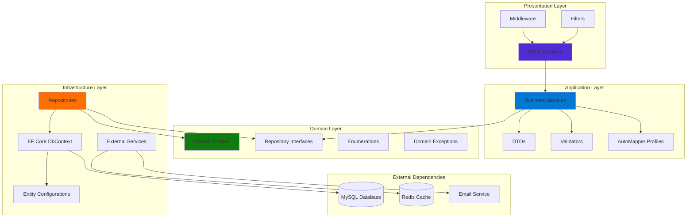

# FreelanceHub Core API

**Enterprise-Grade Backend System for Freelance Marketplace Platform**

[](https://dotnet.microsoft.com/)
[](https://www.mysql.com/)
[](https://redis.io/)
[](https://www.docker.com/)
[](https://github.com/yourusername/FreelanceHub-Core-API/actions)
[](LICENSE)

## 🎯 Overview

FreelanceHub Core API is a **production-ready, enterprise-grade REST API** built with **.NET 8.0** following **Clean Architecture** principles. This system demonstrates deep backend engineering expertise suitable for **high-ticket freelance clients**, **SaaS platforms**, and **enterprise applications**.

### Key Highlights

- ✅ **Clean Architecture** with strict separation of concerns
- ✅ **SOLID Principles** throughout the codebase
- ✅ **JWT Authentication** with refresh token rotation
- ✅ **Role-Based Access Control (RBAC)**
- ✅ **Repository Pattern** with Unit of Work
- ✅ **Entity Framework Core** with optimized queries
- ✅ **MySQL Database** with normalized schema
- ✅ **Redis Caching** for performance optimization
- ✅ **FluentValidation** for request validation
- ✅ **AutoMapper** for object mapping
- ✅ **Soft Delete** pattern implementation
- ✅ **Audit Trail** with activity tracking
- ✅ **Global Exception Handling**
- ✅ **Docker & Docker Compose** ready
- ✅ **Swagger/OpenAPI** documentation
- ✅ **Scalable & High-Load Ready**

---

## 🏗️ Architecture

### Clean Architecture Layers

```
FreelanceHub-Core-API/
│
├── FreelanceHub.Domain/              # Enterprise Domain Layer
│   ├── Entities/                     # Domain entities with rich behavior
│   │   ├── User.cs
│   │   ├── Project.cs
│   │   ├── Bid.cs
│   │   ├── Payment.cs
│   │   ├── Message.cs
│   │   ├── Notification.cs
│   │   ├── Review.cs
│   │   └── ...
│   ├── Enums/                        # Domain enumerations
│   ├── Interfaces/                   # Repository abstractions
│   ├── Exceptions/                   # Domain-specific exceptions
│   └── ValueObjects/                 # Value objects (future)
│
├── FreelanceHub.Application/         # Application Business Logic
│   ├── DTOs/                         # Data Transfer Objects
│   │   ├── Auth/
│   │   ├── Project/
│   │   ├── Bid/
│   │   ├── Payment/
│   │   └── Common/
│   ├── Services/                     # Business logic services
│   │   └── Interfaces/
│   ├── Validators/                   # FluentValidation validators
│   └── Mappings/                     # AutoMapper profiles
│
├── FreelanceHub.Infrastructure/      # Infrastructure & Data Access
│   ├── Data/                         # DbContext & UnitOfWork
│   │   ├── ApplicationDbContext.cs
│   │   └── UnitOfWork.cs
│   ├── Repositories/                 # Repository implementations
│   ├── Configurations/               # EF Core entity configurations
│   └── Services/                     # Infrastructure services
│
├── FreelanceHub.API/                 # Presentation Layer
│   ├── Controllers/                  # REST API endpoints
│   ├── Middleware/                   # Custom middleware
│   ├── Filters/                      # Action filters
│   └── Extensions/                   # Service extensions
│
└── tests/                            # Testing Projects
    ├── FreelanceHub.UnitTests/
    └── FreelanceHub.IntegrationTests/
```

### Architecture Diagram



### Dependency Flow

**Key Principle:** Dependencies point inward. Domain has no dependencies. Infrastructure depends on Domain.

```
┌─────────────────────────────────────────────┐
│         Presentation Layer (API)            │
│  Controllers, Middleware, Filters           │
└──────────────────┬──────────────────────────┘
                   │
                   ▼
┌─────────────────────────────────────────────┐
│        Application Layer                    │
│  Services, DTOs, Validators, Mappers        │
└──────────────────┬──────────────────────────┘
                   │
                   ▼
┌─────────────────────────────────────────────┐
│          Domain Layer (Core)                │
│  Entities, Interfaces, Business Rules       │
└─────────────────────────────────────────────┘
                   ▲
                   │
┌──────────────────┴──────────────────────────┐
│       Infrastructure Layer                  │
│  Repositories, DbContext, External Services │
└─────────────────────────────────────────────┘
```

---

## 🚀 Tech Stack

### Core Technologies

| Technology | Version | Purpose |
|------------|---------|---------|
| **.NET** | 8.0 | Core framework (LTS) |
| **ASP.NET Core** | 8.0 | Web API framework |
| **C#** | 12.0 | Programming language |
| **Entity Framework Core** | 8.0 | ORM |
| **MySQL** | 8.0+ | Primary database |
| **Pomelo.EntityFrameworkCore.MySql** | 8.0 | MySQL provider |

### Authentication & Security

- **JWT (JSON Web Tokens)** - Stateless authentication
- **Refresh Tokens** - Token rotation strategy
- **BCrypt** - Password hashing
- **HTTPS** - Encrypted communication
- **CORS** - Cross-origin resource sharing
- **Rate Limiting** - API throttling
- **Input Validation** - FluentValidation

### Infrastructure & DevOps

- **Docker** - Containerization
- **Docker Compose** - Multi-container orchestration
- **Redis** - Distributed caching
- **Serilog** - Structured logging
- **Swagger/OpenAPI** - API documentation

### Libraries & Patterns

- **AutoMapper** (11.0.1) - Object-to-object mapping
- **FluentValidation** (10.4.0) - Validation library
- **Repository Pattern** - Data access abstraction
- **Unit of Work** - Transaction management
- **Dependency Injection** - IoC container

---

## 📊 Database Schema

### Core Entities

#### Users & Authentication
- **Users** - User accounts with roles
- **RefreshTokens** - JWT refresh tokens
- **FreelancerProfiles** - Freelancer-specific data
- **ClientProfiles** - Client-specific data

#### Projects & Bidding
- **Projects** - Job postings
- **Bids** - Freelancer proposals
- **Milestones** - Project milestones

#### Transactions
- **Payments** - Payment records
- **Messages** - Internal messaging
- **Notifications** - User notifications
- **Reviews** - Rating system
- **UserActivities** - Audit trail

### Key Features

✅ **Normalized Schema** - 3NF compliance  
✅ **Optimized Indexes** - Fast query performance  
✅ **Soft Deletes** - Data retention  
✅ **Audit Fields** - CreatedAt, UpdatedAt, DeletedAt  
✅ **Foreign Key Constraints** - Data integrity  
✅ **Cascade Rules** - Proper deletion behavior  

---

## 🔐 Authentication & Authorization

### JWT Authentication Flow

```
1. User registers/logs in
2. Server generates Access Token (15 min) + Refresh Token (7 days)
3. Client stores tokens securely
4. Client sends Access Token in Authorization header
5. On expiry, client uses Refresh Token to get new Access Token
6. Refresh Token rotation on each refresh
```

### Security Features

- ✅ **Secure Password Hashing** (BCrypt with salt)
- ✅ **Token Expiration** (Access: 15min, Refresh: 7 days)
- ✅ **Token Rotation** (Refresh tokens are single-use)
- ✅ **Token Revocation** (Logout invalidates tokens)
- ✅ **Email Verification** (Account activation)
- ✅ **Password Reset** (Secure token-based flow)
- ✅ **Account Locking** (Brute-force protection)
- ✅ **Role-Based Authorization** (Admin, Client, Freelancer, Moderator)

### Endpoints

```http
POST   /api/auth/register          # User registration
POST   /api/auth/login             # User login
POST   /api/auth/refresh-token     # Refresh access token
POST   /api/auth/revoke-token      # Logout
POST   /api/auth/verify-email      # Email verification
POST   /api/auth/forgot-password   # Request password reset
POST   /api/auth/reset-password    # Reset password
```

---

## 📡 API Endpoints

### Projects

```http
GET    /api/projects                    # Search projects (paginated)
GET    /api/projects/{id}               # Get project details
POST   /api/projects                    # Create project (Client only)
PUT    /api/projects/{id}               # Update project (Owner only)
DELETE /api/projects/{id}               # Delete project (Owner only)
POST   /api/projects/{id}/publish       # Publish project
POST   /api/projects/{id}/close         # Close project
GET    /api/projects/my                 # Get user's projects
```

### Bids

```http
GET    /api/bids/{id}                   # Get bid details
POST   /api/bids                        # Submit bid (Freelancer only)
GET    /api/bids/project/{projectId}    # Get project bids
GET    /api/bids/my                     # Get user's bids
POST   /api/bids/{id}/accept            # Accept bid (Client only)
POST   /api/bids/{id}/reject            # Reject bid (Client only)
DELETE /api/bids/{id}                   # Withdraw bid (Freelancer only)
```

### Payments

```http
GET    /api/payments/{id}               # Get payment details
POST   /api/payments                    # Create payment
GET    /api/payments/project/{id}       # Get project payments
GET    /api/payments/sent               # Get sent payments
GET    /api/payments/received           # Get received payments
```

### Messages

```http
GET    /api/messages                    # Get user messages
GET    /api/messages/{id}               # Get message details
POST   /api/messages                    # Send message
GET    /api/messages/conversation/{userId} # Get conversation
POST   /api/messages/{id}/read          # Mark as read
```

### Notifications

```http
GET    /api/notifications               # Get user notifications
GET    /api/notifications/unread-count  # Get unread count
POST   /api/notifications/{id}/read     # Mark as read
POST   /api/notifications/read-all      # Mark all as read
```

---

## 🛠️ Setup & Installation

### Prerequisites

- **.NET SDK 8.0+** ([Download](https://dotnet.microsoft.com/download/dotnet/8.0))
- **MySQL 8.0+** ([Download](https://dev.mysql.com/downloads/))
- **Redis 7.0+** (Optional, for caching) ([Download](https://redis.io/download))
- **Docker Desktop** (Recommended) ([Download](https://www.docker.com/))

### Local Development Setup

#### 1. Clone Repository

```bash
git clone https://github.com/yourusername/FreelanceHub-Core-API.git
cd FreelanceHub-Core-API
```

#### 2. Configure Database

Update `appsettings.Development.json`:

```json
{
  "ConnectionStrings": {
    "DefaultConnection": "Server=localhost;Database=FreelanceHubDB;User=root;Password=yourpassword;"
  },
  "JwtSettings": {
    "Secret": "your-super-secret-key-min-32-characters",
    "Issuer": "FreelanceHub",
    "Audience": "FreelanceHubUsers",
    "AccessTokenExpirationMinutes": 15,
    "RefreshTokenExpirationDays": 7
  },
  "Redis": {
    "ConnectionString": "localhost:6379"
  }
}
```

#### 3. Run Migrations

```bash
cd src/FreelanceHub.API
dotnet ef database update --project ../FreelanceHub.Infrastructure
```

#### 4. Run Application

```bash
dotnet run
```

API will be available at: `https://localhost:5001`  
Swagger UI: `https://localhost:5001/swagger`

---

## 🐳 Docker Deployment

### Using Docker Compose

```bash
docker-compose up -d
```

This will start:
- **API** (port 5000)
- **MySQL** (port 3306)
- **Redis** (port 6379)

### Docker Compose Configuration

```yaml
version: '3.8'

services:
  api:
    build: .
    ports:
      - "5000:80"
    environment:
      - ASPNETCORE_ENVIRONMENT=Production
      - ConnectionStrings__DefaultConnection=Server=mysql;Database=FreelanceHubDB;User=root;Password=rootpassword;
      - Redis__ConnectionString=redis:6379
    depends_on:
      - mysql
      - redis

  mysql:
    image: mysql:8.0
    environment:
      MYSQL_ROOT_PASSWORD: rootpassword
      MYSQL_DATABASE: FreelanceHubDB
    ports:
      - "3306:3306"
    volumes:
      - mysql_data:/var/lib/mysql

  redis:
    image: redis:alpine
    ports:
      - "6379:6379"

volumes:
  mysql_data:
```

---

## 🧪 Testing

### Run Unit Tests

```bash
cd tests/FreelanceHub.UnitTests
dotnet test
```

### Run Integration Tests

```bash
cd tests/FreelanceHub.IntegrationTests
dotnet test
```

### Test Coverage

```bash
dotnet test /p:CollectCoverage=true /p:CoverletOutputFormat=opencover
```

---

## 📈 Performance & Scalability

### Optimization Strategies

✅ **Database Indexing** - Optimized queries with proper indexes  
✅ **Redis Caching** - Distributed caching for frequently accessed data  
✅ **Async/Await** - Non-blocking I/O operations  
✅ **Connection Pooling** - Efficient database connections  
✅ **Query Optimization** - EF Core query performance tuning  
✅ **Pagination** - Large dataset handling  
✅ **Lazy Loading Disabled** - Explicit eager loading  
✅ **Response Compression** - Reduced payload size  

### Scalability Features

- **Stateless API** - Horizontal scaling ready
- **Distributed Caching** - Redis for multi-instance deployments
- **Database Read Replicas** - Read/write separation support
- **Load Balancer Ready** - No session state dependencies
- **Microservices Ready** - Modular architecture

---

## 🔒 Security Best Practices

✅ **HTTPS Only** - Encrypted communication  
✅ **CORS Configuration** - Controlled cross-origin access  
✅ **SQL Injection Protection** - Parameterized queries  
✅ **XSS Protection** - Input sanitization  
✅ **CSRF Protection** - Token-based validation  
✅ **Rate Limiting** - API throttling  
✅ **Secure Headers** - HSTS, X-Frame-Options, etc.  
✅ **Sensitive Data Protection** - No secrets in logs  
✅ **Password Policies** - Strong password requirements  
✅ **Account Lockout** - Brute-force protection  

---

## 📚 API Documentation

### Swagger/OpenAPI

Access interactive API documentation at:

```
https://localhost:5001/swagger
```

### Comprehensive Documentation

- **[API Documentation](API_DOCUMENTATION.md)** - Complete API reference with examples
- **[Architecture Guide](ARCHITECTURE.md)** - System design and patterns
- **[Quick Start Guide](QUICKSTART.md)** - Get started in 5 minutes
- **[Contributing Guidelines](CONTRIBUTING.md)** - How to contribute
- **[Changelog](CHANGELOG.md)** - Version history
- **[Security Policy](SECURITY.md)** - Security guidelines
- **[Code of Conduct](CODE_OF_CONDUCT.md)** - Community standards

### Postman Collection

Import the Postman collection from `/docs/FreelanceHub.postman_collection.json`

---

## 🎓 Learning & Best Practices

### Design Patterns Used

- **Repository Pattern** - Data access abstraction
- **Unit of Work** - Transaction management
- **Dependency Injection** - Loose coupling
- **Factory Pattern** - Object creation
- **Strategy Pattern** - Algorithm encapsulation
- **CQRS** (Optional) - Command/Query separation

### SOLID Principles

- **S**ingle Responsibility - Each class has one reason to change
- **O**pen/Closed - Open for extension, closed for modification
- **L**iskov Substitution - Derived classes are substitutable
- **I**nterface Segregation - Specific interfaces over general
- **D**ependency Inversion - Depend on abstractions

---

## 🚀 Production Deployment

### Checklist

- [ ] Update `appsettings.Production.json` with production values
- [ ] Configure production database connection string
- [ ] Set up Redis for production
- [ ] Configure HTTPS certificates
- [ ] Enable logging (Serilog to file/cloud)
- [ ] Set up health checks
- [ ] Configure rate limiting
- [ ] Enable response compression
- [ ] Set up monitoring (Application Insights, etc.)
- [ ] Configure CI/CD pipeline
- [ ] Database backup strategy
- [ ] Disaster recovery plan

### Environment Variables

```bash
ASPNETCORE_ENVIRONMENT=Production
ConnectionStrings__DefaultConnection=<production-db-connection>
JwtSettings__Secret=<production-secret>
Redis__ConnectionString=<production-redis>
```

---

## 📊 Monitoring & Logging

### Serilog Configuration

Logs are written to:
- **Console** (Development)
- **File** (Production: `/logs/`)
- **Application Insights** (Optional)

### Health Checks

```http
GET /health
GET /health/ready
GET /health/live
```

---

## 🤝 Contributing

Contributions are welcome! Please read our [Contributing Guidelines](CONTRIBUTING.md) for details on our code of conduct and the process for submitting pull requests.

Quick start:

1. Fork the repository
2. Create a feature branch (`git checkout -b feature/AmazingFeature`)
3. Commit your changes (`git commit -m 'Add AmazingFeature'`)
4. Push to the branch (`git push origin feature/AmazingFeature`)
5. Open a Pull Request

---

## 📄 License

This project is licensed under the MIT License - see the [LICENSE](LICENSE) file for details.

---

## 👨‍💻 Author

- Email: i2497247@gmail.com
---

## 🎯 Why This Project?

This project demonstrates:

✅ **Enterprise-Level Architecture** - Production-ready, scalable design  
✅ **Clean Code Principles** - SOLID, DRY, KISS  
✅ **Security Best Practices** - Industry-standard authentication & authorization  
✅ **Performance Optimization** - Caching, indexing, async operations  
✅ **Modern .NET Ecosystem** - Latest patterns and libraries  
✅ **Real-World Complexity** - Multi-entity relationships, business logic  
✅ **DevOps Ready** - Docker, CI/CD, monitoring  
✅ **Professional Documentation** - Clear, comprehensive, maintainable  

**Perfect for showcasing to high-ticket clients, enterprise employers, and SaaS platforms.**

---

## 📞 Support

For questions or support, please open an issue or contact me directly.

---

**Built with ❤️ using .NET 8.0 and Clean Architecture principles**
